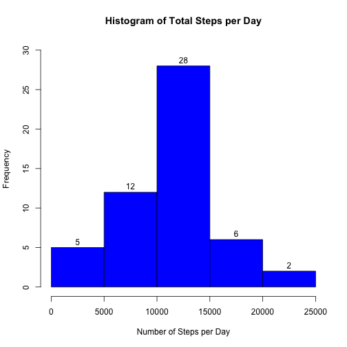
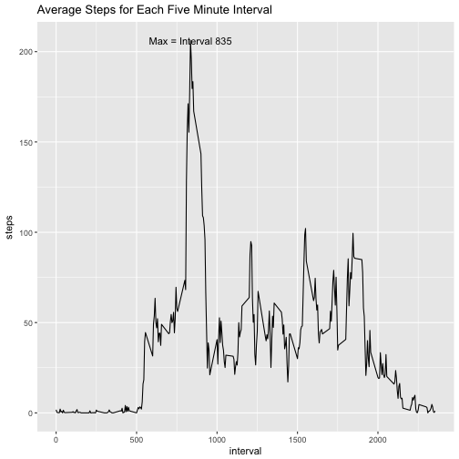
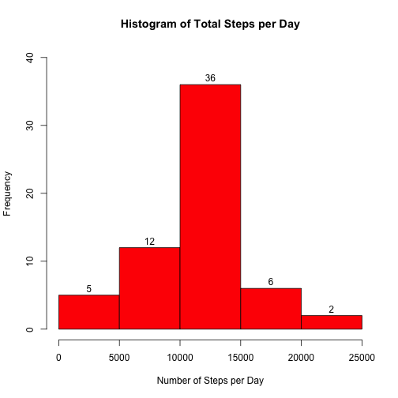
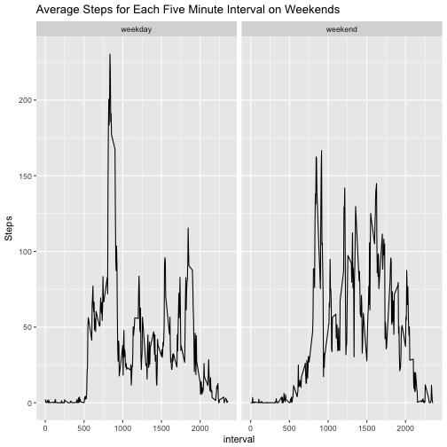

First the data files need to be downloaded, unzipped and read into R.

```r
data1 <- "activity.zip"
if(!file.exists(data1)){
        fileURL <- "https://d396qusza40orc.cloudfront.net/repdata%2Fdata%2Factivity.zip"
        download.file(fileURL, data1, method = "curl")
}
if(!file.exists("activity.csv")){
        unzip(data1)
}
activity <- read.csv("activity.csv")
```
The class of the variable date needs to be changed from character to "Date".

```r
activity$date <- as.Date(activity$date)
```
The dataset should be subsetted to remove NAs and should also be grouped by day so the total steps per day can be plotted.

```r
library(dplyr)
activity_subset <- activity %>%
        filter(steps != "NA") %>%
        group_by(date) %>%
        summarise(Steps = sum(steps))
```
Plot a histogram showing the frequency of total steps per day.

```r
hist(activity_subset$Steps, xlab = "Number of Steps per Day",
        main = "Histogram of Total Steps per Day", col = "blue", labels = T, ylim = c(0,30))
```



Calculate the mean and median number of steps taken each day.

```r
mean_steps = mean(activity_subset$Steps)
median_steps = median(activity_subset$Steps)
print(mean_steps)
```

```
## [1] 10766.19
```

```r
print(median_steps)
```

```
## [1] 10765
```
Next the intervals are grouped and the average for each interval is calculated.

```r
activity_interval_subset <- activity %>%
        filter(steps != "NA") %>%
        group_by(interval) %>%
        summarise(steps = mean(steps))
```
The average steps for each interval is plotted, and the interval with the maximum value for steps is labeled on the plot. The plot is a time series for the 5 minute intervals.

```r
max_steps <- filter(activity_interval_subset, steps == max(steps))
library(ggplot2)
ggplot(activity_interval_subset, aes(interval, steps)) +
        geom_line() +
        geom_text(data = max_steps, aes(x = interval, y = steps,
        label = "Max = Interval 835")) +
        ggtitle("Average Steps for Each Five Minute Interval")
```



Calculate the number of NA values for steps

```r
sum(is.na(activity$steps))
```

```
## [1] 2304
```
Since the missing NA values are potentially meaningful, the NAs will be imputed by taking the average for each interval and then applying this mean to each value that corresponds to the interval. First, a data frame with the NA rows needs to be created.

```r
activity1 <- activity[rowSums(is.na(activity)) > 0, ]
activity1$steps <- as.numeric(activity1$steps)
activity_interval_subset <- as.data.frame(activity_interval_subset)
```
From the package DataCombine, FillIn takes as arguments two data frames and selected values from the second data frame replace values from the first. In this case, the interval averages are replacing NAs that correspond to a particular interval. 

```r
library(DataCombine)
filled_data <- FillIn(activity1, activity_interval_subset, "steps", "steps", "interval")
```

```
## 2304 NAs were replaced.
```
Now that all of the NAs for the steps variable is in the data frame filled_data, this data frame can be merged with a filtered version of the original data set that omits NAs through an rbind.

```r
activity_subset_NA.RM <- activity %>%
        filter(steps != "NA")
merged_data <- (rbind(activity_subset_NA.RM, filled_data))
```
Now this is the full data set with NAs replace. This data set needs to be grouped by date so a histogram can be created.

```r
grouped_merged <- merged_data %>%
        group_by(date) %>%
        summarise(Steps = sum(steps))
```
Now a histogram can be plotted. It is similar to the first plot but does have a higher frequency near the center of the histogram, as would be expected.

```r
hist(grouped_merged$Steps, xlab = "Number of Steps per Day",
        main = "Histogram of Total Steps per Day", col = "red", labels = T, ylim = c(0,40))
```



Now the weekdays and weekends are going to be compared. A new variable "day" is created with 2 levels, "weekday" and "weekend".

```r
merged_data$day <- ifelse(weekdays(merged_data$date) %in% c("Saturday", "Sunday"),
        "weekend", "weekday")
```
Now the data need to be grouped by interval, splitting by weekdays and weekends.

```r
merged_days <- merged_data %>%
        group_by(interval, day) %>%
        summarise(Steps = mean(steps))
```
Two plots will be created, one for weekends and one for weekdays.

```r
ggplot(merged_days, aes(interval, Steps)) +
        geom_line() +
        ggtitle("Average Steps for Each Five Minute Interval on Weekends") + 
        facet_wrap(~day)
```



